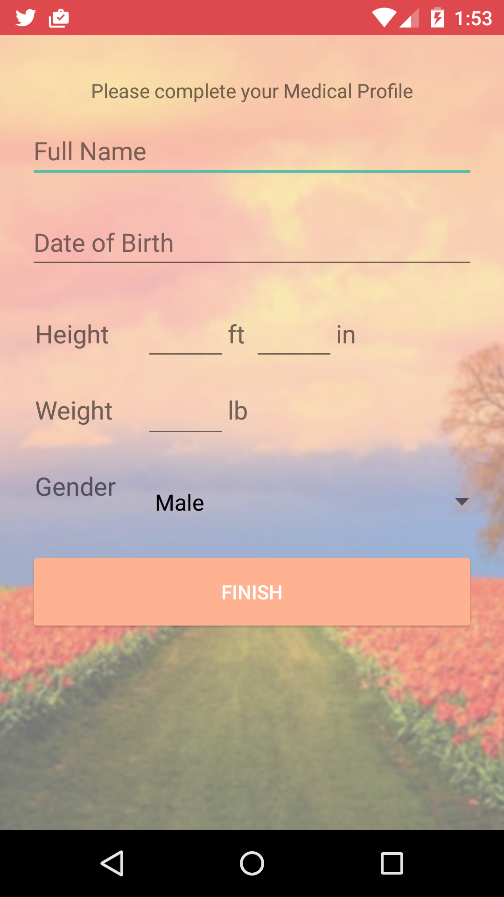
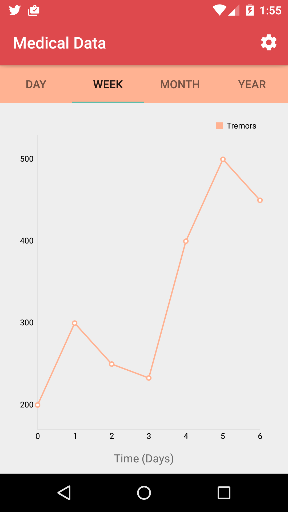
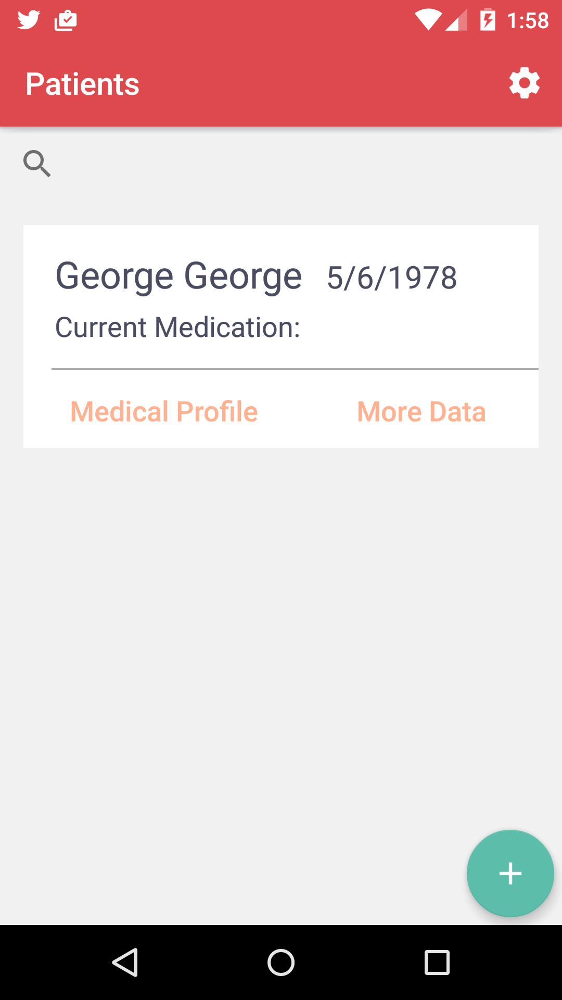
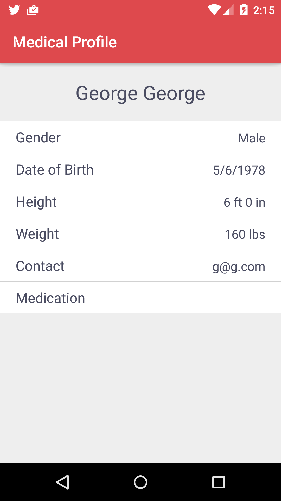

# Tulyp

 Tulyp is an app that uses wearables to collect data for Parkinson’s patients. Using Tulyp, patients can track the progression of their disease, and give access to doctors to view that data. Doctors will be able to code the data and graphs by the medication the patient is taking, which will allow them to compare how patients react to the various medications. This will allow them to create more personalized treatments, which is necessary since Parkinson’s is a disease that affects everyone in different ways.

## Team Members    
* Kathy Liang	  
* Tae Min (Thomas) Kim	  
* Jenny Chen	    
* Nicholas Osborne Hardison-Moschopoulos    
* Vishal Goel						

## Screenshots
  

  

